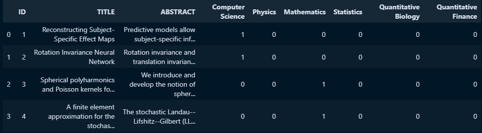

# Multi-label Article classification using BERT and PyTorch
This notebook tries to fine-tune BERT for multi-label classification of research articles. The dataset used is the taken from [Janatahack NLP Topic Modeling](https://www.kaggle.com/code/venkatkrishnan/81-5-janatahack-nlp-topic-modeling/input?select=train.csv) from Kaggle. The dataset contains title and abstract of research articles and the task is to predict the topics associated with the article. The topics are represented as 0/1 values in the dataset. The dataset contains 6 topics and each article can have multiple topics associated with it. The topics are as follows:
* Computer Science
* Physics
* Mathematics
* Statistics
* Quantitative Biology
* Quantitative Finance

Following table shows the sample data from the dataset:


## Usage
This notebook was made using Google Colab and is expected to be run on it. The dataset is uploaded to Google Drive and downloaded to the Colab notebook.
The notebook is self-explanatory and can be run cell by cell. Click on open in Colab button to open the notebook in Colab.\
<a target="_blank" href="https://colab.research.google.com/github/SrjPdl/multi-label-article-classification-bert">
  
</a>

## Results
The model was trained for 5 epochs and the best model was saved at epoch 4. Following are the results of the model on the training and validation set:
```
Epoch 4 - Average Train Loss: 0.1312
Epoch 4 - Validation Loss: 0.1687
``````
Following are the results of the model on the test set:
```
Test Loss: 0.1366
```
### Confusion Matrix
The confusion matrix for the test set are as follows:


### Classification Report
The classification report for the test set is shown below:


### ROC Curve
The ROC curve for the test set is shown below:


## Author
Suraj Poudel
